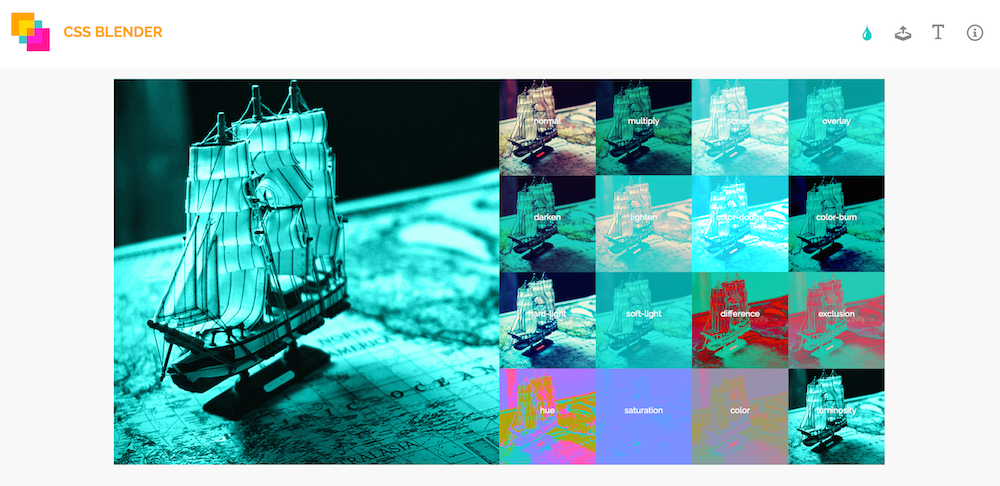

##Compositing And Blending In CSS
##CSS中的拼接与混合

If you're a designer, then you've probably already come across blending effects some time or the other. Blending is one of the most frequently used effects in graphic and print design. You can add texture to text by blending it with its textured backdrop, create an illusion of merged images by blending these images together, and create a wide range of colorful effects that would not be possible without that fine level of color blending control.

如果你事一个设计师，你一定已经或者迟早会遇到混合效果。混合是在图形和印刷设计方面被使用最频繁的效果之一。你可以通过混合文字和纹理背景来给文字添加纹理，把图片混合在一起创造融合图片的幻觉，以及创造那些广泛而丰富多彩的效果，如果没有对混色控制达到如此精细的程度要创造这些效果是不可能的。


Graphics editors such as Photoshop or Illustrator come with a set of blending modes. **Blend modes** allow you to specify how you want your elements to blend together, thus changing the colors of the area where these elements intersect. Each mode uses a specific color formula to mix the colors of the source and the destination.

图形编辑器例如Photoshop或Illustrator自带了一系列混合模式。**混合模式**让你可以指定混合的元素，从而改变元素交叉区域的颜色。每个模式使用一个特定颜色公式来混合基色和目标色。

Different modes give different end results. Before we talk about the different blend modes, and since we mentioned the **source** and **destination** elements, let's have a quick look at the concept of compositing, and how it is related to blending in CSS.

不同模式带来不同最终结果。在我们讨论不同混合模式前，既然我们提到了**基**和**目标**元素，让我们快速的了解一下合成的概念，以及它和CSS中的混合有什么关系。

###What Is Compositing?
###合成是什么？

Compositing is the combining of a graphic element with its backdrop.

合成是图形元素与背景的结合。

A **backdrop** is **the content behind the element** and is what the element is composited with.

**背景**是**位于元素后面的内容**并且也是元素与之合成的内容。


Compositing defines how what you want to draw will be blended with what is already drawn on the canvas. The source is what you want to draw, and the destination is what is already drawn (the backdrop).

合成定义了你想要绘制的元素将会如何与画布上已经绘制的元素混合。基是你想要绘制的元素，目标是你已经绘制的元素（背景）。

So, if you have two elements, and these elements overlap, you can think of the element on top as being the source, and the parts of the element behind that lie beneath it, will be the destination.

所以，如果你有两个元素，这些元素交叠在一起，你可以把上层的元素当做基，另一个元素位于它下面的部分是目标。

Using different composite operations (there are 16 operations), you can specify which parts of the two overlapping elements will be drawn, and which will not.

使用不同的复合操作（有16种操作），你可以指定绘制两个重叠元素的哪些部分，哪些不绘制。


These composite operations are known as **Porter Duff compositing operations**. These operations specify what portions of the source and destination will be drawn, and blend modes specify how how the colors from the graphic element (source) and the backdrop (destination) interact. The illustrations in the above image are from the Compositing and Blending spec. In HTML5 Canvas context, these oprations are specified using the `globalCompositeOperation` property, and can be used to clip backgrounds to specific shapes, such as text, thus creating the effect of texture-filled text in Canvas. I have written about this process in [this article](http://tympanus.net/codrops/2013/12/02/techniques-for-creating-textured-text/) over at Codrops.

这些复合操作叫做**Porter Duff混合操作**。这些操作指定源和目标的哪些部分被绘制，混合模式指定图形元素（源）上的颜色如何与背景（目标）混合。上面图片中的插图来自合成和混合规范。在HTML5 Canvas的背景中，这些操作通过`globalCompositeOperation`属性指定，可以用来把背景裁切成特定图形，例如文字，从而在画布上创建纹理填充文本效果。我已经在Codrops上的[这篇文章](http://tympanus.net/codrops/2013/12/02/techniques-for-creating-textured-text/)中提到了这个过程。

Together, Porter Duff Compositing and blending form the overall compositing operation for intersecting elements. According to the specification, “typically, the blending step is performed first, followed by the Porter-Duff compositing step. In the blending step, the resultant color from the mix of the element and the the backdrop is calculated. The graphic element’s color is replaced with this resultant color. The graphic element is then composited with the backdrop using the specified compositing operator.”

总之，Porter Duff合成和混合是对于交叉元素的总体合成操作。根据这个规格，“通常，首先进行混合步骤，然后进行Porter-Duff合成步骤。在混合步骤时，会计算混合元素的合成色以及背景。图形元素的颜色被合成色替代。图形元素随后由使用指定合成操作形成的背景合成。”

Therefore, the way two intersecting or overlapping elements are handled is by blending their colors based on a blend mode, and then drawing only the parts specified by the composite operation.

因此，两个相交或重叠的元素基于一个混合模式处理混合颜色，然后只绘制复合操作指定的部分。

In CSS, we have no way to specify a composite operation. The default composite operation used is source-over. Both the source and the destination elements remain, and the area where they intersect is blended using the blend mode specified.

在CSS中，没有办法指定合成操作。默认使用的合成操作是源-覆盖。源和目标元素都保留，使用指定混合模式混合它们重叠的区域。

Before the [Compositing and Blending specification](http://www.w3.org/TR/compositing-1/) was introduced, CSS allowed one type of composite operations: simple alpha compositing. This is what the `opacity` property is for. By changing an element's opacity, the browser makes it translucent so that the colors of its backdrop can show through.

在[合成和混合规则](Compositing and Blending specification](http://www.w3.org/TR/compositing-1/)提出前，CSS只有一种合成操作：简单alpha合成。这是`opacity`属性的作用。通过改变元素的不透明度，浏览器让它变得透明使它的背景可以显示出来。

Today, two main properties exist that allow us to blend elements and backround images by specifying one of 16 available blend modes. These two properties are `background-blend-mode` and `mix-blend-mode`. Let's get to know each.

如今，已经存在两个主要属性允许我们指定16种可用混合模式的一种来混合元素和背景图片。这两个属性是 `background-blend-mode`和`mix-blend-mode`。让我们都来了解一下。

###Blending Background Layers: The `Background-Blend-Mode` Property
混合背景层：`Background-Blend-Mode`属性

The `background-blend-mode` property, as its name suggests, is used to specify a blend mode for an element's background layer. A background layer can be an image, or the background color.

`background-blend-mode`属性，像名字一样，用来给元素背景层指定一个混合模式。背景层可以是图片，或背景色。

In other words, `background-blend-mode` allows you to blend together an element's background image with the images and/or background color behind it.

换句话说，`background-blend-mode`允许你把元素的背景图片和它背后的图片和/或背景色混合在一起。

If the element has more than one background image, you can specify multiple blend modes—each blend mode will be used for a background image such that the first blend mode in the list corresponds to the first background image in the list of background images, and so on.

如何这个元素有超过一张的背景图，你可以指定多个混合模式-每个混合模式用在一个背景图上并且列表上的第一个混合模式对应背景图列表中的第一张背景图，以此类推。

Then, each background layer is blended with the element’s background layer that is below it and the element’s background color. Which means that, if you have two background images and a background color:

随后，背景层与元素的背景层以及元素的背景色混合。意味着，如果你有两张背景图和一个背景色：

```
	background-image: url(first-image.png), url(second-image.png);
	background-color: orange;
	background-blend-mode: screen, multiply;
```

The `second-image.png` background will blend with the background color using the `multiply` mode, and then the `first-image.png` background will blend with the second image and the background color using the `screen` blend mode. (Reminder: the first background image in the list is the one on top, and the ones following it are beneath it.)

背景图`second-image.png`会使用`multiply`模式和背景色混合，背景图`first-image.png`会使用`screen`模式和第二张图片以及背景色混合。（提示：第一张背景图位于上层，随后一张位于下层。）

Note that an element's background layers must not blend with the content that is behind the element, instead they must act as if they are rendered into an **isolated group**.

注意元素的背景层不能和元素后面的内容混合，它们必须表现得像渲染成一个**独立的组**。

Also note that if the `background` shorthand is used, the `background-blend-mode` property for that element must be reset to its initial value.

还要注意如果使用了`background`的速记形式，这个元素的`background-blend-mode`属性必须重置成初始值。

###The Blend Modes
###混合模式

Okay so we've established that each background layer can get its own blend mode which specifies how it blends with the layers beneath it. But what blend mode options do we have?

既然每个背景层可以指定混合模型来与它下面的层混合。但是我们可以用哪些混合模式选项呢？

There are 16 blend modes available in CSS: `normal` (which is the default blend mode and means that no blending is applied), `multiply`, `screen`, `overlay`, `darken`, `lighten`, `color-dodge`, `color-burn`, `hard-light`, `soft-light`, `difference`, `exclusion`, `hue`, `saturation`, `color` and `luminosity`.

CSS里有16中可用的混合模式：`normal` (默认混合模式代表没有添加混合模式), `multiply`, `screen`, `overlay`, `darken`, `lighten`, `color-dodge`, `color-burn`, `hard-light`, `soft-light`, `difference`, `exclusion`, `hue`, `saturation`, `color` 和 `luminosity`。

Each filter, when applied to an image, for example, will give a different end result—the colors of the image are going to be changed based on the mode you choose.

例如，每个滤镜应用在图片上时，会产生不同的最终结果-图片的颜色为会根据你选择的模式变化。

`normal`

`正常模式`

This is the default mode which specifies no blending. The blending formula simply selects the source 
color.
默认模式不指定混合。混合公式选择源颜色。

`multiply`

`正片叠底模式`

The source color is multiplied by the destination color and replaces the destination. The resultant color is always at least as dark as either the source or destination color. **Multiplying any color with black results in black. Multiplying any color with white preserves the original color.**

基色和目标颜色复合后替换目标颜色。合成色无论如何与源或者目标色一样深。**任何颜色与黑色复合得到黑色。任何颜色与白色复合保持初始颜色。**

`screen`

`滤色模式`

Multiplies the complements of the backdrop and source color values, then complements the result. The result color is always at least as light as either of the two constituent colors. **Screening any color with white produces white; screening with black leaves the original color unchanged.** The effect is similar to projecting multiple photographic slides simultaneously onto a single screen.

把背景的补集和目标颜色值复合，补足结果。结果色总是和两个构成色一样浅。**任何颜色与白色滤色产生白色；和黑色滤色保留颜色不变。**效果类似于在一个屏幕上投影多个幻灯片。

`overlay`

`叠加模式`

Multiplies or screens the colors, depending on the backdrop color value. Source colors overlay the backdrop while preserving its highlights and shadows. The backdrop color is not replaced but is mixed with the source color to reflect the lightness or darkness of the backdrop.

对颜色正片叠底或滤色依赖于背景色值。基色覆盖背景同时保留高光和阴影。背景色没有被替换但是与基色混合来反映背景的亮暗。

`darken`

`变暗模式`

Selects the darker of the backdrop and source colors. The backdrop is replaced with the source where the source is darker; otherwise, it is left unchanged.

选择背景和基色的较暗部分。背景被基色中较暗的部分替换；否则，保持不变。

`lighten`

`变亮模式`

Selects the lighter of the backdrop and source colors. The backdrop is replaced with the source where the source is lighter; otherwise, it is left unchanged.

选择背景和基色中较亮的部分。背景被基色中较亮的部分替换；否则，保持不变。

`color-dodge`

`颜色减淡模式`

Brightens the backdrop color to reflect the source color. Painting with black produces no changes.

减淡背景色来反映基色。黑色绘制的部分不变。

`color-burn`
`颜色加深模式`

Darkens the backdrop color to reflect the source color. Painting with white produces no change.

加深背景色来反映基色。白色绘制的部分不变。

`hard-light`

`强光模式`

Multiplies or screens the colors, depending on the source color value. The effect is similar to shining a harsh spotlight on the backdrop.

对颜色正片叠底或滤色依赖于基色值。效果类似于在背景上用强聚光灯照射。

`soft-light`

`柔光模式`

Darkens or lightens the colors, depending on the source color value. The effect is similar to shining a diffused spotlight on the backdrop.

使颜色变暗或变亮，取决于基色值。效果类似于在背景上用发散的聚光灯照射。

`difference`

`差值模式`

Subtracts the darker of the two constituent colors from the lighter color. Painting with white inverts the backdrop color; painting with black produces no change.

从较浅的颜色中减去两个组成颜色的较深部分。白色绘制的部分背景反色；黑色绘制的部分不变。

`exclusion`

`排除模式`

Produces an effect similar to that of the Difference mode but lower in contrast. Painting with white **inverts the backdrop color**; painting with black produces no change.

产生类似于差值模式的效果但是对比度更低。白色绘制的部分**背景反色**；黑色绘制的部分不变。

`hue`

`色相模式`

Creates a color with the hue of the source color and the saturation and luminosity of the backdrop color.

创建于基色的色相、饱和度和亮度相同的颜色。

`saturation`

`饱和度模式`

Creates a color with the saturation of the source color and the hue and luminosity of the backdrop color. Painting with this mode in an area of the backdrop that is a pure gray (no saturation) produces no change.

创建饱和度与基色相同，色相和亮度与背景色相同的颜色。在背景是纯灰（没有饱和度）的区域使用这个模式不产生改变。

`color`

`颜色模式`

Creates a color with the hue and saturation of the source color and the luminosity of the backdrop color. This preserves the gray levels of the backdrop and is useful for coloring monochrome images or tinting color images.

创建色相和量度和基色相同，饱和度和背景色相同的颜色。保持背景的灰度并且对于给单色图片或图片着色很有用。

`luminosity`

`亮度模式`

Creates a color with the luminosity of the source color and the hue and saturation of the backdrop color. This produces an inverse effect to that of the Color mode. This mode is the one you can use to create monchrome "tinted" image effects like the ones you can see in different website headers.

###monchrome错字

创建亮度和基色相同，色相和饱和度与背景色相同的颜色。产生这个颜色模式反色的效果。你可以用这个模式创建和不同网页头部的图片效果一样的单色图片效果。

The following image shows the result of applying the different blend modes to an image, in the same order mentioned above, starting from the top left corner.

下面图片展示了在一张图片上添加不同混合模式的结果，跟上述提到的顺序一致，从左上角开始。


For more information about these blend modes, I refer you to [this article](http://www.slrlounge.com/school/photoshop-blend-modes/) on the SLR Lounge blog. It claims to be the ultimate visual guide to blend modes, and does include some nice explanations of the blend modes.

要获取更多这些混合模式的信息，我推荐你SLR Lounge博客上的[这篇文章](http://www.slrlounge.com/school/photoshop-blend-modes/)。声称是混合模式的终极视觉指南，确实包括了一些关于混合模式非常好的解释。

Personally, I think that even with the definition for each mode at hand, it can be really hard (if not impossible) to predict the result of applying these modes to an image.

从个人角度而言，我认为即使眼前有每个模式的定义，

Picking a suitable blend mode will be—in most cases—a case of trial and error. If you use Instagram you know that sometimes you just go over each of the available filters, applying them one after the other, till you get the effect you're after. (I know I do that!) With CSS blend modes, it's practically the same.

For that reason, I've created a simple interactive demo that you can use to pick the right blend mode for your effects.



You can upload an image, and choose a background color to blend it with. The background color of the live preview (thumbnails) will live-update as you make your way around the color picker. Clicking on a thumbnail will preview the selected blend mode in the larger preview area.

<a href="http://sarasoueidan.com/demos/css-blender" class="button">Try the blend modes in the demo out.</a>

Of course, the effects will be visible only in browsers that support the background-blend-mode property. For more information about browser support, refer to the compatibility table over at CanIUse.com.

In addition to blending a background image with a background color in the interactive demo, you can also blend a piece of text with the element that has this background.

But blending separate elements together requires a property other than the background-blend-mode property. Let's have a look at that next.

Blending An Element With Elements In Its Backdrop: The Mix-Blend-Mode Property
As we mentioned earlier, a backdrop is the content behind the element and is what the element is composited with.

The content behind the element can be anything—including other elements. And this is where the interesting effects come in. Think fixed headers blending with the content as the page scrolls down, or text blended with an image in the background, or text blending with other text, etc.

Blending elements together is done using the mix-blend-mode property.

The mix-blend-mode property is similar to the background-blend-mode property, and takes the same blend mode values. So, you can specify any blend mode to get different blending effects.

For example, the text in the following image blends with the image behind it using mix-blend-mode: difference, giving the illusion of the water bubbles passing through and in front of the text. The reason this effect is established is the color inversion process of the difference mode.


The area of the image where it overlaps with the text is the text's backdrop, and that is where the blending happens. You can check the live demo out here.

Using mix-blend-mode, you can create many creative effects—far more than I could list in this post. One particularly interesting effect you can create is see-through text. Without CSS blend modes, you would need CSS masking and/or background clipping, along with some CSS hackery to create this effect and make it work.

With blend modes, and using the difference blend mode again, you can create this effect by—again—leveraging the color inversion process.

The following image shows this effect in action. It is merely a piece of text, positioned on top of an image, and blended with it.


That's pretty cool, isn't it? You can check the live demo out here.

It is worth noting here that the colors you choose strongly affect the end result. That being said, the interactive demo can make picking the right colors for such an effect easier and faster.

In the interactive demo, you have an option to add editable text to the preview area, and then style that text and blend it with the preview image using mix-blend-mode. The following is a screenshot showing an example.


<a href="http://sarasoueidan.com/demos/css-blender" class="button">Check the demo out.</a>

Since we're talking about blending elements together, it only makes sense that we mention stacking contexts, especially considering that they affect how and what elements can be blended together.

According to the specification, applying a blend mode other than normal to the element must establish a new stacking context on that element, forming a group. This group must then be blended and composited with the stacking context that contains the element.

Also, an element that has blending applied, must blend with all the underlying content of the stacking context that that element belongs to. It will not blend with contents outside that context.

For example, the following image shows the result of mix-blending two images with the overlay mode. (Live demo)


The code for the above simple example looks like so:

```
	<div class="container">
	  
	  <div class="img-wrapper">
	    
	  </div>
	</div>
```

I've wrapped the image on top (the .source) in a div that I'm going to create a stacking context on. Since the opacity property leads to the creation of a new stacking context when given a value other than th default (1), I'm going to use that.

```
	.img-wrapper {
	  opacity: .99;
	}
```

(Try it in the live demo.)

By creating a stacking context, the .source image no longer blends with the bottom image, because the latter lies outside the stacking context containing the former.

This is because we have isolated the image (and any other contents of the .img-wrapper context) from the rest of the elements, and thus they don't blend with their backdrops anymore.

This brings us to the isolation property. But before we move on, note that the mix-blend-mode property also applies to SVG elements, and can be used to blend overlapping SVG elements together as well. As a matter of fact, the logo for the CSS Blender demo is a result of applying a mix-blend-mode to the three squares that make the demo up. You can see how the areas where these squares overlap have different colors due to the color blending applied.

Browser support for the mix-blend-mode property is not as wide as that of the background-blend-mode property. For details, refer to the browser compatibility table over at CanIUse.com.

Isolating Elements: The Isolation Property

When a property that leads to the creation of a stacking context is applied to an element, that element is said to be isolated. The last example in the previous section is an example of this happening.

On the other hand, you can use the isolation property to isolate elements.

In SVG, this property defines whether an element is isolated or not. For CSS, setting isolation to isolate will turn the element into a stacking context, and thus affect whether or not the element's contents can blend with their backdrop lying outside this context. By default, the isolation property is set to auto—which implies that they are not isolated.

If we were to go back to the previous example with the two blended images, we can prevent the image on top from blending with the image behind it by using the isolation property instead of the opacity property.

```
	.img-wrapper {
	  isolation: isolate;
	}
```

This has the same effect as using opacity in the previous example. If you use this rule instead of opacity in the live demo, you will get the same result.

Note that by creating a stacking context on an element, you are isolating the content of that element and preventing them from blending with the backdrop of that element. However, you can still apply a blend mode to the entire context to blend it with its backdrop.

Moreover, If you are using thebackground-blend-mode property, the isolation property is not needed since background layers must not blend with the content that is behind the element, instead they must act as if they are rendered into an isolated group (the element itself), as specified in the specification. This is why the isolation property will have an effect when used with the mix-blend-mode property, but not with the background-blend-mode property.

Note: Order Of Graphical Operations
CSS blending modes, filters and masks, can all be applied to the same element. But which effect is applied first?

According to the specification, first any filter effect is applied, then any clipping, masking, blending and compositing.

Final Words
With all the graphical operations available to us via CSS, we are getting more possibilities for designing in the browsers—this is particularly interesting if you—like me—are not into graphics editors and don't know your way around them well.

The web platform team at Adobe have been doing a tremendous job bringing many of their tools' graphical capabilities to the web. From filters, to blend modes, clipping and masking, and even CSS Shapes, we are gaining more control over layout and graphics on the web.

Many creative effects can be created using CSS blend modes, and when combined with other technologies, they open a door to endless creative possibilities.

I hope you liked this article and found it useful.

Thank you for reading!