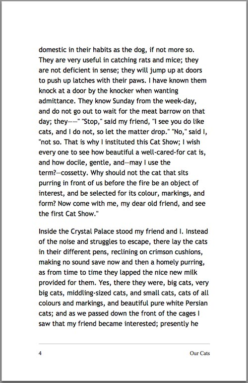
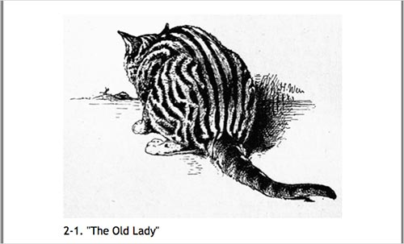

##Designing For Print With CSS
##用CSS设计印刷品

#####If you mention printing with CSS to many people who work on the web, print style sheets are the use that comes to mind. We are all well used to creating a style sheet that is called upon when a web document is printed. These style sheets ensure that the print version is legible and that we don’t cause a user to print out huge images. However, CSS is also being used to format books, catalogs and brochures — content that may never have been designed to be a web page at all.

#####如果你对许多从事网页开发的人提起在印刷品中使用CSS，他们第一反映会想到使用打印样式表。当网页文档需要被打印时，我们已经习惯于创建一个打印样式表。这些样式表确保打印版本清晰并且保证用户不会打印出巨幅图像。然而，CSS也被用来排版图书，商品目录以及宣传册 - 这些内容在以前可能从来没有被设计成网页。

In this article, we’ll take a look at the CSS modules that have been created not for use in web browsers, but to deal with printed and paged media. I’ll explain how the selectors, properties and values that they introduce work. I’ll finish up with a working example that you can use as a starting point for your own experiments. For that example, we’ll need a user agent that supports this specialized CSS. I’ll be using Prince, which is a commercial product. However, Prince has a free version that can be used for non-commercial use, making it a good tool to try out these examples.

在这篇文章里，我们将探索一些已有的CSS模型，它们不是为了在网页浏览器中使用，而是为了解决打印和分页媒体中的问题。我将解释选择器，属性和值的作用。最后我会提供一个实际例子，你可以把它作为自己试验的基础。对于这个例子，我们需要支持这些特殊CSS的用户代理。我正在用的是Prince，它是一个商业软件。然而，Prince有针对非商业使用的免费版本，是实验这些例子的好工具。

###Why HTML And CSS Make Sense For Print
###为什么HTML和CSS对印刷有意义
It may seem a bit strange that content not particularly destined for the web should be maintained as HTML and formatted with CSS. It seems less strange when you realize that popular eReader formats such as EPUB and MOBI are HTML and CSS under the hood. In addition, even if the entirety of a manuscript or catalog isn’t to be published on a website, some of it likely will be. HTML becomes a handy format to standardize on, far easier to deal with than having everything in a Word document or a traditional desktop publishing package.

非要用HTML去维护和用CSS去排版那些不是特意为网页设计的内容似乎有点奇怪。但是当你意识到流行的电子阅读格式例如EPUB和MOBI在底层是由HTML和CSS组成时就没那么奇怪了。另外，即便手稿或目录没有被整个发布到网页上，一些类似的东西可能会。HTML成为了一个方便的格式化标准，比起把所有东西都放在一个Word文档或者传统的桌面出版包中更容易处理。

####The Differences Between CSS For The Web And CSS For Print
####网页CSS和印刷CSS的区别
The biggest difference, and conceptual shift, is that printed documents refer to a page model that is of a fixed size. Whereas on the web we are constantly reminded that we have no idea of the size of the viewport, in print the fixed size of each page has a bearing on everything that we do. Due to this fixed page size, we have to consider our document as a collection of pages, paged media, rather than the continuous media that is a web page.

最大的区别和观念的转变在于印刷文档需要一个固定大小的页面模型。在网页上我们不断被提醒我们不知道视口尺寸，在印刷中每个固定尺寸的页面承载了我们所有的东西。因为页面尺寸固定，我们需要把文档考虑成网页的集合，即分页媒体，而不是连续媒体即网页。

Paged media introduces concepts that make no sense on the web. For example, you need to be able to generate page numbers, put chapter titles in margins, break content appropriately in order that figures don’t become disassociated from their captions. You might need to create cross-references and footnotes, indexes and tables of content from your document. You could import the document into a desktop publishing package and create all of this by hand, however, the work would then need redoing the next time you update the copy. This is where CSS comes in, whose specifications are designed for use in creating paged media.

分页媒体的内容在网页上毫无意义。例如，你需要能生成页码，给章节标题添加边距，适当划分内容并保证图形和说明不脱钩。也许你要创建交叉参考和脚注，索引和文档目录。你可以把文档引入桌面发布包并且手动创建这些内容，然而，当你下次更新复本时需要重复这些工作。这时候CSS就起到作用，它的规则是为创建分页媒体而设计。

Because the specifications are designed for paged media, we won’t be considering browser support in this article — it wouldn’t make a lot of sense. Later on, we’ll look at a user agent designed to turn your HTML and CSS into a PDF using these specifications.

因为规则是为分页媒体而设计，在这篇文章里我们不考虑浏览器兼容性 - 这没多大意义。稍后，我们会看一个被设计成使用特定规则把HTML和CSS转换成PDF的用户代理。

###The Specifications
###规则
Much of the CSS you already know will be useful for formatting for print. Specifically for print, we have the “[CSS Paged Media Module](http://www.w3.org/TR/css3-page/)” and the “[CSS Generated Content for Paged Media Module](http://www.w3.org/TR/css-gcpm-3/)” specifications. Let’s look at how these work.

你已知的大多数CSS在印刷品排版中有效。在印刷品中比较特别的是，我们有“[CSS分页媒体模型](http://www.w3.org/TR/css3-page/)”和“[CSS分页媒体模型的生成内容](http://www.w3.org/TR/css-gcpm-3/)”规则。让我们看一下这些规则如何生效。

####THE @PAGE RULE
The `@page` rule lets you specify various aspects of a page box. For example, you will want to specify the dimensions of your pages. The rule below specifies a default page size of 5.5 by 8.5 inches. If you intend to print a book, perhaps by a print-on-demand service, then finding out the sizes you can use is important.

`@page`规则允许你指定页面盒的许多方面。例如，你想要指定页面尺寸。下面这条规则指定默认页面尺寸是5.5*8.5英尺。如果你想打印一本书，也许通过按需打印服务，找到可用尺寸很重要。
```
@page {
  size: 5.5in 8.5in;
  }
```
In addition to specifying sizes with length values, you may also use paper size keywords, such as “A4″ or “legal.”

除了可以用长度值声明尺寸，你还可以使用纸质尺寸关键字，例如"A4"或“法定”。
```
@page {
  size: A4;
  }
```
You may also use a keyword to specify the page’s orientation — “portrait” or “landscape.”

你也可以使用关键字来指定页面方向 - “人像”或“风景”。
```
@page {
  size: A4 landscape;
  }
```

####UNDERSTANDING THE PAGE MODEL
####理解页面模型
Before going any further, we should understand how the page model for paged media works, because it behaves somewhat differently to how things work on screen.

进一步讨论前，我们需要理解分页媒体运行的页面模型，因为它和运行在屏幕上的内容表现上有一些不同。

The page model defines a page area and then 16 surrounding [margin boxes] (http://www.w3.org/TR/css3-page/#margin-boxes). You can control the size of the page area and the size of the margin between the edge of the page area and the end of the page itself. The table in the specification explains very well how these boxes are sized.

页面模型定义了一块页面区域和16个环绕的[边距盒](http://www.w3.org/TR/css3-page/#margin-boxes)。你可以控制页面区域的尺寸以及页面区域边界与页面自身结尾之间边距的尺寸。规范中的表格很好得解释了如何定义这些盒子尺寸。


The page area is the space on the page into which your page’s content will flow. When it runs out of room, another page will be created. The margin boxes are used only for CSS-generated content.

页面区域是页面上一块页面内容流动的空间。当超出了它的容纳范围，就会创建另一个页面。边界盒只在CSS生成的内容上使用。

####LEFT AND RIGHT PAGE SPREADS
####奇偶数页面传递

Another aspect of the page model is that it defines pseudo-class selectors for the left and right pages of your document. If you look at any printed book you have on hand, you’ll probably see that the margin’s size and the margin’s content are different on the left and right pages.

页面模型的另一方面是它定义了伪类选择器来选择文档的偶数或奇数页。如果你看一下手边的任何印刷书，你会发现边距尺寸和边距内容在偶数和奇数页上是不一样的。

We can use these selectors to define different margin sizes for our pages.

我们可以用这些选择器给页面定义不同的边距尺寸。
```
@page :left {
  margin-left: 3cm;
  }
@page :right {
  margin-left: 4cm;
  }
```
Two other pseudo-class selectors are defined. The `:first` selector targets the first page of a document.
规则还定义了两个伪类选择器。`:first`选择器选中是文档的第一页。
```
@page :first {

}
```

The `:blank` pseudo-class selector targets any page that is “intentionally left blank.” To add this text, we can use generated content that targets the top-center margin box.

`:blank`伪类选择器选中任何“故意左侧留白”的页面。要添加这样的文字，我们可以使用目标是边距盒顶部中心的生成内容。
```
@page :blank {
  @top-center { content: "This page is intentionally left blank." }
}
```

####GENERATED CONTENT AND PAGED MEDIA
####生成内容和页面媒体
In the last example, we used CSS-generated content to add the text to the top-center margin box. As you will discover, generated content is vitally important to creating our book. It’s the only way things can be added to our margin boxes at all. For example, if we want to add the title of the book to the bottom-left margin box of right-hand pages, we would do this using generated content.

在上个例子中，我们使用CSS生成内容在边距盒的顶部中心添加文字。你会发现，生成内容在创建书的时候至关重要。这是把东西添加到边距盒上的唯一方式。例如，如果我们想把书名添加到奇数页边距盒的左下角，我们会用生成内容来实现。
```
@page:right{ 
	  @bottom-left {
	    margin: 10pt 0 30pt 0;
	    border-top: .25pt solid #666;
	    content: "My book";
	    font-size: 9pt;
	    color: #333;
	  }
  }
```
####PAGE BREAKS
####分页符
Also part of the “Paged Media” specification is information about how to control page breaks. As already described, once the content fills a page area, it will move onto a new page. If a heading has just been written to the page, you might end up with a page that finishes with a heading, with the related content beginning on the next page. In a printed book, you would try to avoid this situation. Other places you might want to avoid a break are in the middle of a table and between a figure and its caption.

另外“页面媒体”部分特殊之处在于如何控制分页。像描述的那样，一旦内容充满页面区域，它会移到新页面上。如果标题正好才写到页面上，可能页面会以标题结束，相关内容在下一页开始。在印刷书中，你会试图避免这种情况。其他你想要避免断开的地方还有表格中间以及图形和对应的说明间。

Starting a new chapter of a book with an `h1` heading is common. To force this heading to always be the beginning of a page, set `page-break-before` to `always`.

通常用`h1`标题来开始一本书的新章节。要强制标题总是处于页面开头，把`page-break-before`设置为`always`。

```
h1 {
  page-break-before: always;
  }
```
To avoid breaks directly after a heading, use `page-break-after`.
为了避免标题后立即断页，使用`page-break-after`。
```
h1, h2, h3, h4, h5 {
  page-break-after: avoid;
  }
```
To avoid breaking figures and tables, use the `page-break-inside` property.
为了避免断开图解和表格，使用`page-break-inside`属性
```
table, figure {
  page-break-inside: avoid;
  }
```

####COUNTERS
####计数器
Books are all about numbering things — pages, chapters, even figures. We can actually add these numbers via CSS, saving us from having to renumber everything because we decided to, say, add a new figure partway through a chapter. We do this using [CSS counters](https://developer.mozilla.org/en-US/docs/Web/Guide/CSS/Counters).

书总是跟数字相关-页，章节，甚至图解。我们可以通过CSS添加这些数字，避免由于我们打算在章节中添加一个新的图解而把所有东西重新编号。我们使用[CSS计数器](https://developer.mozilla.org/en-US/docs/Web/Guide/CSS/Counters)来实现。

The obvious place to start is with page numbers. CSS gives us a predefined page counter; it starts at 1 and increments with every new page. In your style sheet, you would use this counter as the value of generated content, to put the page counter in one of your margin boxes. In the example below, we are adding page numbers to the bottom-right of right-hand pages and the bottom-left of left-hand pages.

首先开始的地方显然是页码。CSS提供了预定义页面计数器；它从1开始并且每新的一页加1。在你的样式表中，你会使用这些计数作为生成内容的值，把页数放到边距盒的其中之一。在下面的例子中，我们把页码放在奇数页的右下角和偶数页的左下角。
```
@page:right{
  @bottom-right {
    content: counter(page);
  }
  }
@page:left{
  @bottom-left {
    content: counter(page);
 }
}
```
We’ve also created a counter named `pages`. This counter will always be the total number of pages in your document. If you want to output “Page 3 of 120,” you can.

我们还创建了一个叫做`pages`的计数器。这个计数器的值总是文档总页数。如果你想输出“120页中的第3页”，你可以像下面那样做。
```
@page:left{
  @bottom-left {
    content: "Page " counter(page) " of " counter(pages);
  }
  }
```
You can create your own named counters and increment and reset them as you require. To create a counter, use the `counter-reset` property, increment it with `counter-increment`. The CSS rules below will create a counter for chapters named `chapternum` and `increment` it with each h1 — being the start of a chapter in this book. We then use the value of that counter in generated content to add the chapter number and a period before the chapter’s actual title.

你可以创建自己命名的计数器和增量并且按需要重置它们。要创建一个计数器，使用`counter-reset`属性，通过`counter-increment`增加。下面的CSS规则会为章节创建一个叫`chapternum`的计数器并且每出现`h1`增加-在这本书中作为每个章节的开始。随后我们使用计数器的值在生成内容中章节的实际标题前添加章数和时间。
```
body {
  counter-reset: chapternum;
  }
h1.chapter:before {
  counter-increment: chapternum;
  content: counter(chapternum) ". ";
  }
```

We can do the same for figures in the book. A common way to number figures is to use `chapternum.figurenum`. So, “Figure 3-2″ would be the second figure in chapter 3. On the `h1`, we could reset `figurenum` in order that it starts from 1 for each chapter.

书中图解的计数我们也可以用同样方法。通常给图解计数的方法是使用`chapternum.figurenum`。所以“Figure 3-2”代表第三章第二幅图。在`h1`里，我们可以重置`figurenum`让它每章都从1开始。

```
body {
  counter-reset: chapternum figurenum;
}

h1 {
  counter-reset: figurenum;
}

h1.title:before {
  counter-increment: chapternum;
  content: counter(chapternum) ". ";
}

figcaption:before {
  counter-increment: figurenum;
  content: counter(chapternum) "-" counter(figurenum) ". ";
}
```

####SETTING STRINGS
####设置字符

Take a look at a printed book again. As you leaf through a chapter, you’ll probably see that the chapter’s title is printed on the left or right page. As strange as it may sound, the “Generated Content for Paged Media” specification lets us achieve this using CSS.

让我们再看一下印刷图书。当你翻阅一章，你会看到章节标题印在偶数或奇数页上。也许听起来很奇怪，“页面媒体生成内容”规范让我们通过CSS来实现。

We do this using a property named `string-set` in the selector that we want to take the content from. For the chapter title, this would be the `h1`. The value of `string-set` is the name you would like to give this content and then `content()`. You can then output this as generated content using `string()`.

我们在想要获取内容的选择器中使用`string-set`属性来实现，这将成为`h1`。`string-set`的值是你想给这段内容取得名字然后使用`content()`。随后你可以用`string()`作为生成内容输出。

```
h1 { 
  string-set: doctitle content(); 
}

@page :right {
  @top-right {
    content: string(doctitle);
    margin: 30pt 0 10pt 0;
    font-size: 8pt;
  }
}
```

When your paged media is generated, each time an `h1` occurs, the content is written to `doctitle` and then outputted in the top-right margin box of right-hand pages, changing only when another `h1` occurs.

当你的页面媒体生成后，每当出现`h1`，内容被写入`doctitle`然后输出到右侧页的右上边距盒中，只有当另一个`h1`出现才发生改变。

####FOOTNOTES
####脚注
Footnotes are a part of the “[CSS Generated Content for Paged Media Module](http://www.w3.org/TR/css-gcpm-3/#footnotes)” specification. The way footnotes work is that you would add the text of your footnote inline, wrapped in HTML tags (probably a span), with a class to identify it as a footnote. When the page is generated, the content of that “footnote element” is removed and turned into a footnote.

脚注是“[CSS页面媒体模型生成内容](http://www.w3.org/TR/css-gcpm-3/#footnotes)”规范的一部分。脚注原理是在脚注行内添加文本，包裹在HTML标签中（很可能是span），用一个类定义它为脚注。当页面生成时，这个“脚注元素”的内容会被移除然后转换成脚注。

In your CSS, use the footnote value of the `float` property to create a rule for your footnote class.

在CSS文件中，使用脚注的`float`属性值来给脚注类创建规则。

```
.fn {
  float: footnote;
}
```

In your document, use that class to wrap any footnote text.
在你的文档中，使用这个类来包裹任何脚注文本。
```
<p>Footnotes<span class="footnotes">Footnotes and notes placed in the footer of a document to reference the text. The footnote will be removed from the flow when the page is created.</span> are useful in books and printed documents.</p>
```
Footnotes have a predefined counter that behaves in the same way as the page counter. Typically, you will want to increment the counter by 1 each time a `fn` class occurs and reset it at the beginning of each chapter.

脚注有一个预定义计数器表现和页面计数器一样。通常，你想让计数器每次`fn`类出现时增加1并且在每一章开始时被重置。

```
.fn {
  counter-increment: footnote;
}

h1 {
  counter-reset: footnote;
}
```

The various parts of a footnote can be targeted with CSS pseudo-elements. The `footnote-call` is the numeric anchor in the text that indicates there is a footnote. This uses the value of the footnote counter as generated content.

脚注的不同部分可以用CSS伪元素来选中。`footnote-call`是文本中指示脚注的数值锚。它使用脚注计数器的值作为生成的内容。

```
.fn::footnote-call {
  content: counter(footnote);
  font-size: 9pt;
  vertical-align: super;
  line-height: none;
}
```

The `footnote-marker` is the numeric marker placed in front of the footnote text in the footer of your document. These behave in a similar way to the numbers generated for an ordered list in CSS.

`footnote-marker`是放置在文档底部脚注前的一个数值标记。原理和CSS中生成有序列表的数值类似。

```
.fn::footnote-marker {
  font-weight: bold;
}
```

The footnotes themselves are placed in the margin, within a special area of the page named `@footnotes`. You would target and style that area as follows.

脚注处于边界内，在页面中一块特殊区域叫做`@footnotes`。你可以用下面的方式选中并给这块区域赋予样式。

```
page {
  @footnotes {
    border-top: 1pt solid black;
  }
}
```

####CROSS-REFERENCES
####交叉引用
Before moving on to a working example of everything we’ve learned, let’s look at cross-references. On the web, we cross-reference things by adding links. In a book or other printed document, you would normally refer to the page number where that reference is to be found. Because page numbers might change according to the format that the book is printed in — and between editions — doing this with CSS saves us from having to go through and change all of the numbers.

在我们继续谈论把我们所学运用其中的例子之前，让我们看一下交叉引用。在网页中，我们通过添加链接交叉引用。在书和其他打印文档中，通常依靠页码寻找引用。因为页码也许会随着书的不同版本打印形式的变化而改变 - 通过CSS实现让我们不需要检查和改变所有数字。

We use another new property, `target-counter`, to add these numbers. Start by creating links in your document, giving them an `href`, which is the ID of the element in the document that you want to target. Also, add a class to identify them as a cross-reference, rather than an external link; I’m using `xref`.

我们用另一个新属性，`target-counter`，添加这些数字。在文档中创建链接时，赋予它们`href`，值为你想要标记的文档中的元素的ID。此外，增加一个类来识别它们是交叉引用，而不是一个外部链接；我用`xref`。

```
<a class="xref" href="#ch1" title="Chapter 1">Chapter 1</a>
```

Then, after the link, use generated content again to output `(page x)`, where `x` is the number of the location in the book where that ID can be found.

然后，在这个链接后，再一次使用生成内容输出`(page x)`，`x`是ID在书中位置的数值。

```
a.xref:after {
  content: " (page " target-counter(attr(href, url), page) ")";
}
```

We’ll be looking at this technique in practice when we create a table of contents for the working example.

当我们为实际例子创建目录时会在实践中查看这个技术。

####Putting It All Together: An Example Book
####结合上述：一本样例书

We’ve looked at a lot of different properties here in isolation. They make more sense once you put them to use by building a book.

我们分别看了很多不同的属性。一旦你通过创建一本书把它们放到一起时它们会更有意义。

To actually create a book using this CSS, you’ll need a user agent that supports it. Currently, very few things implement this specification well; the one that is most accessible is [Prince](http://princexml.com/). A standalone commercial license for Prince is expensive, however, you may use Prince free of charge for non-commercial projects. This means that if you just want to try out these techniques, you can. Additionally, if you do have non-commercial uses for this technology, you may use Prince to format those books.

真正用CSS来创建一本书，你需要一个支持的用户代理。现在，很少有东西很好得实现这些规范；目前最好用的是[Prince](http://princexml.com/)。Prince的独立商业许可很贵，但是你可以在非商业项目中免费使用Prince。这意味着如果你只是想尝试这些技术，你可以用。另外，如果你确实有使用这项技术的非商业需求，你也许可以用Prince来排版这些书。

I have extracted passages from one of my favorite books on Project Gutenberg, [Our Cats by Harrison Weir](http://www.gutenberg.org/ebooks/35450). I’ve chosen this book because I like cats and because it has images and footnotes that I can use to demonstrate formatting.

我从古腾堡项目里最喜欢的书，[Harrison Weri的Our Cats](http://www.gutenberg.org/ebooks/35450)中提取了一些段落，我选这本书因为我喜欢猫并且它有图片和脚注可以用来验证排版。

You can find the files I am using, plus a generated PDF, over [on GitHub](https://github.com/rachelandrew/css-for-print). If you want to experiment with the CSS and build the book yourself, then you will need to download and install [Prince](http://princexml.com/). Prince is a command-line tool on the Mac, and although there is a Windows GUI, I’ll use the command line because it really is very simple.

你可以在[GitHub上](https://github.com/rachelandrew/css-for-print)找到我用的文件，加上一份生成的PDF。如果你想用CSS实验并且自己编译这本书，你需要下载和安装[Prince](http://princexml.com/)。Prince是Mac下的命令行工具，虽然也有Windows GUI，我使用命令行因为它真的很简单。

Using a Terminal window, switch to your book’s directory or the location where you downloaded my files from GitHub.

使用命令窗口，切换到你书的目录或者你从GitHub上下载文件的路径。

```
cd /Users/username/smashing-css-books
```

Now, run Prince:
现在，运行Prince：

```
prince -s pdf-styles.css book.html builds/book.pdf
```

This will create a PDF in the `builds` folder named `book.pdf`. Now, if you make any changes to the CSS or HTML, you can run Prince to see what is different.

这会在`builds`目录下创建一个叫`book.pdf`的PDF文件。现在，如果你对CSS或HTML做了任何更改，你可以运行Prince来看一下发生了什么变化。

####THE HTML DOCUMENT
####HTML文档
My entire “book” is compiled in a single HTML document. Compiling documents in Prince is possible, but I’ve found it simpler to just deal with one large document. Before the chapters, which start with an `h1`, I have a div that contains the cover image, and then the table of contents for the book.

我整本“书”是在一个HTML文档中编译的。在Prince中编译文档是可能的，但我发现只有在处理一个比较大的文档时才比较方便。在每个由`h1`开始的章节前，我都放了一个div包含了封面图，然后是书的目录。

The table of contents links to the IDs of the chapters’ h1 headings.

目录链接到每个章节`h1`标题的ID。

```
<!DOCTYPE html>
<html dir="ltr" lang="en-US">
  <head>
  <meta charset="utf-8" />
  <title>Our Cats and All About Them</title>
  <meta name="author" content="Harrison Weir"/>
  <meta name="subject" content="Cats. Their Varieties, Habits and Management; and for show, the Standard of Excellence and Beauty"/>
  <meta name="keywords" content="cats,feline"/>
  <meta name="date" content="2014-12-05"/>
  </head>
  <body>
    <div class="frontcover">
    </div>
    <div class="contents">
      <h1>Extracts from Our Cats and All About Them by Harrison Weir</h1>

        <ul class="toc">
          <li><a href="#ch1">The First Cat Show</a></li>
          <li><a href="#ch2">Trained Cats</a></li>
          <li><a href="#ch3">General Management</a></li>
          <li><a href="#ch4">Superstition and Witchcraft</a></li>
        </ul>

    </div>

    <h1 id="ch1" class="chapter">The First Cat Show</h1>
      <p>… </p>

    <h1 id="ch2" class="chapter">Trained Cats</h1>
      <p>… </p>

    <h1 id="ch3" class="chapter">General Management</h1>
      <p>… </p>

    <h1 id="ch4" class="chapter">Superstition and Witchcraft</h1>
      <p>… </p>

  </body>
</html>
```

The CSS then uses all of the things we have described so far. To start, we need to set up a size for the book using the `@page` rule. We then use the `:first` pseudo-class selector to remove the margin on page 1, because this page will have the cover image.

接下来的CSS中使用了我们目前为止讨论的所有东西。一开始，我们需要用`@page`规则设定书的尺寸。然后使用`:first`伪类选择器来移除第1页的边距，因为这一页会有封面图。

```
@page {
  size: 5.5in 8.5in;  
  margin: 70pt 60pt 70pt;
}

@page:first {
  size: 5.5in 8.5in;  
  margin: 0;
}
```

We then deal with the image for the front cover, making sure that it covers the whole page area.

然后我们处理封面的图片，确保它覆盖了整个页面区域。

```
div.frontcover { 
  page: cover; 
  content: url("images/cover.png");
  width: 100%;
  height: 100%; 
}
```


Next, we deal with the specifics of the left- and right-hand pages, using the `:right` and `:left` spread pseudo-classes.

下一步，我们处理偶数和奇数页的细节，使用`:right`和`:left`传递伪类选择器。

The right-hand spread will have the title of the book in the bottom-left margin box, a page counter in the bottom-right, and the chapter’s title in the top-right. The chapter’s title is set using `string-set` further down in the style sheet.

奇数传递会让书的标题处于边框盒左下方，页数在右下方，章节标题在右上方。章节标题随后在样式表中用`string-set`设置。

```
@page:right{ 
  @bottom-left {
    margin: 10pt 0 30pt 0;
    border-top: .25pt solid #666;
    content: "Our Cats";
    font-size: 9pt;
    color: #333;
  }

  @bottom-right { 
    margin: 10pt 0 30pt 0;
    border-top: .25pt solid #666;
    content: counter(page);
    font-size: 9pt;
  }

  @top-right {
    content:  string(doctitle);
    margin: 30pt 0 10pt 0;
    font-size: 9pt;
    color: #333;
  }
}
```


The left-hand spread has the book’s title in the bottom-right and the page counter in the bottom-left.

偶数传递让书的标题处于右下方以及页数处于左下方。

```
@page:left {
  @bottom-right {
    margin: 10pt 0 30pt 0;
    border-top: .25pt solid #666;
    content: "Our Cats";
    font-size: 9pt;
    color: #333;
  }

  @bottom-left { 
    margin: 10pt 0 30pt 0;
    border-top: .25pt solid #666;
    content: counter(page);
    font-size: 9pt;
  }
}
```



For the first page, which contains the cover image, we’ll make sure that no generated content appears by setting it to `normal`.

对于第一页，包含了封面图，我们通过设置为`normal`来确保没有生成内容。
```
@page:first {
  @bottom-right {
    content: normal;
    margin: 0;
  }

  @bottom-left {
    content: normal;
    margin: 0;
  }
}
```

The next section of the style sheet deals with counters. In addition to the preset page counter, we are defining counters for chapters and figures.

样式表接下来的一部分处理计数器。除了预设页面计数器外，我们给章节和图解定义计数器。

```
/* Reset chapter and figure counters on the body */
body {
  counter-reset: chapternum figurenum;
  font-family: "Trebuchet MS", "Lucida Grande", "Lucida Sans Unicode", "Lucida Sans", Tahoma, sans-serif;
  line-height: 1.5;
  font-size: 11pt;
}

/* Get the title of the current chapter, which will be the content of the h1.
Reset figure counter because figures start from 1 in each chapter. */
h1 {
  string-set: doctitle content();
  page-break-before: always;
  counter-reset: figurenum;
  counter-reset: footnote;
  line-height: 1.3;
}

/* Increment chapter counter */
h1.chapter:before {
  counter-increment: chapternum;
  content: counter(chapternum) ". ";
}

/* Increment and display figure counter */
figcaption:before {
  counter-increment: figurenum;
  content: counter(chapternum) "-" counter(figurenum) ". ";
}
```

Chapters now have their number placed before the title. Figures also display their number.

现在在标题后章节有了自己的数字。图解也显示出它们的数字。



We create footnotes as in the explanation earlier, superscripting the footnote’s call.

我们像之前解释的那样创建脚注，给脚注引用添加上标。

```
.fn {
  float: footnote;
}

.fn {
  counter-increment: footnote;
}

.fn::footnote-call {
  content: counter(footnote);
  font-size: 9pt;
  vertical-align: super;
  line-height: none;
}

.fn::footnote-marker {
  font-weight: bold;
}

@page {
  @footnotes {
    border-top: 0.6pt solid black;
    padding-top: 8pt;
  }
}
```


We then add some rules to control where pages break. You need to be fairly careful about being too heavy handed with this. If your book has a lot of tables and figures, then adding many specific rules here could cause a lot of long gaps in the book. Experimenting and testing will show how far you can take the control of breaks. I have found the rules below to be a good starting point.

我们添加一些规则来控制页面的中断。你需要非常小心避免过度。如果你的书有许多表格和图表，添加许多细节规则可能导致书中有许多缺口。实验和测试会表明你可以怎样程序控制中断。我总结了下面规则作为一个良好的开端。

Remember that this is a suggestion to the user agent. In some cases, keeping a table from breaking will be impossible if the table doesn’t fit on a page!

记住这只是用户代理的建议。在有些情况，如果表格不适应页面要保持表格不中断是不可能的！


```
h1, h2, h3, h4, h5 {
  font-weight: bold;
  page-break-after: avoid;
  page-break-inside:avoid;
}

h1+p, h2+p, h3+p {
  page-break-before: avoid;
}

table, figure {
  page-break-inside: avoid;
}
```

Finally, we style the table of contents, and we use an interesting trick here. When describing cross-references, I explained how we use `target-counter` to display the page number that the ID is on. This is what we’ll do for our table of contents. The rule below puts the page number after the link to each chapter in the table of contents.

最后，我们给目录赋予样式，这里我们使用有趣的窍门。当描述交叉引用时，我解释了如何使用`target-counter`来显示带ID的页码。这也是我们要对我们的目录做的。下面的规则在目录的每一章的链接后放置页码。

```
ul.toc a::after {
  content: target-counter(attr(href), page);
}
```


Commonly in books, however, you would use leader dots to line up all of the page numbers against the right margin. Amazingly, CSS gives us a way to do this, by adding `leader()` before the number in the generated content.

然而，通常在书中，你会使用前导字符点来组织所有的页码的右边距。让人惊讶的是，CSS提供了我们一个方式来实现这个，通过在生成内容中数字前添加`leader()`。

```
ul.toc a::after {
  content: leader('.') target-counter(attr(href), page);
}
```


We now have a complete style sheet with which to build our book. I’ve avoided spending a lot of time on typography here, concentrating instead on the specifics of creating a book. From this point, however, you can experiment and add your own styles to create a unique book design.

现在我们有了一个完整的样式表来构建我们的书。我避免花费很多时间在排版上，集中精力在创作书的细节上。然而，从这个角度看，你可以实验并且添加你自己的样式来创建独特的书籍设计。

####Not Just Books!
####不仅仅是书！

Remember that these techniques are not just for books. You could use them to generate print and PDF versions of a product catalog directly from the HTML of a website that you have developed for a client. Or you could create flyers and brochures from web content.

记住这些技术不仅仅是为了书。你可以用它们从已经给顾客开发的网站的HTML中生成打印和PDF版本产品目录。或者你可以从网页内容中创建传单和小册子。

If you want to create PDF documents from a website using Prince, then [DocRaptor](https://docraptor.com/) is a great option. This service uses Prince via an API. You can send documents via the API and receive a PDF — perfect for allowing users to download content as a PDF on the fly. Everything we have looked at in this article is possible via an API integration with DocRaptor.

如果你想用Prince从网页中创建PDF文档，[DocRaptor](https://docraptor.com/)是一个好选择。这项服务通过API调用Prince。你可以通过API发送文档并且接收PDF-允许用户转换成PDF下载内容。所有我们在这篇文章中讨论的东西通过DocRaptor整合的API已经都可以实现。

Even if you don’t have an immediate need for PDF generation, it’s a fascinating aspect of CSS — and it’s a useful skill to have tucked away, so that you know what is possible when a use case presents itself.

即使你现在没有生成PDF的需求，这仍然是CSS中一个迷人的领域 - 这是一个隐秘的实用技能，当需求出现时你知道这是可以实现的。

####Resources And Further Reading
####资源和扩展阅读
* “[CSS Paged Media Module Level 3](http://www.w3.org/TR/css3-page/),” W3C
* “[CSS Generated Content for Paged Media Module](http://www.w3.org/TR/css-gcpm-3/),” W3C
* “[Using CSS Counters](https://developer.mozilla.org/en-US/docs/Web/Guide/CSS/Counters),” Mozilla Developer Network
* “[CSS Books: Living Standard](https://books.spec.whatwg.org/),” WHATWG
* “[User Guide for Prince 9.0](http://www.princexml.com/doc/)“
A lot of simple examples that work in Prince
* “[How to Write a Book](http://24ways.org/2013/how-to-write-a-book/),” Jonathan Snook, 24 Ways
* “[Building Books With CSS3](http://alistapart.com/article/building-books-with-css3),” Nellie McKesson, A List Apart
* “[Printing a Book With CSS: Boom!](http://alistapart.com/article/boom),” Bert Bos and Håkon Wium Lie, A List Apart
* “[HTML, EPUB, MOBI, PDF, WTF: Creating an Ebook](http://rachelandrew.co.uk/archives/2014/01/07/html-epub-mobi-pdf-wtf-creating-an-ebook/),” Rachel Andrew