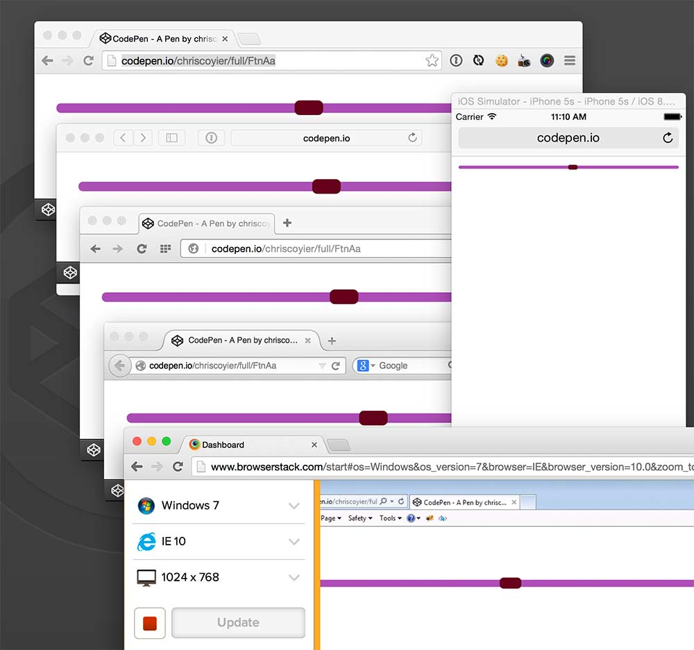

##用CSS创建跨浏览器的range input
>下面这篇文章是[Daniel Stern](https://twitter.com/danieljackstern)的客座文章。Daniel和我分享了一个他做的工具叫做[range.css](http://danielstern.ca/range.css/#/)，它用来给`<input type="range">`创建样式。这是一件比较复杂的事情，因为它需要组合一系列的标准选择和属性以及非标准的前缀选择器和属性。我邀请Daniel对所有这些内容做一个解释。

随着IE10的发布，我们给range input创建样式的能力已经得到了引人注目提高。用纯CSS实现跨浏览器兼容的range input(sliders)已经成为可能。在这篇教程中，我们用基本的range input作为例子：

*Screenshot of a range input, Mac Chrome 38*

然后把它变成：

*Range input with completely custom styles.*

为了简化生成跨浏览器兼容的样式的过程，我们引进LESS。当然也有CSS版本。

###添加基础CSS样式
我们需要给range input添加几个样式来覆盖所有浏览器的默认外观。

	(CSS)

	input[type=range] {
	  -webkit-appearance: none; /* Hides the slider so that custom slider can be made */
	  width: 100%; /* Specific width is required for Firefox. */
	}
	
	input[type=range]::-webkit-slider-thumb {
	  -webkit-appearance: none;
	}
	
	input[type=range]:focus {
	  outline: none; /* Removes the blue border. You should probably do some kind of focus styling for accessibility reasons though. */
	}
	
	input[type=range]::-ms-track {
	  width: 100%;
	  cursor: pointer;
	  background: transparent; /* Hides the slider so custom styles can be added */
	  border-color: transparent;
	  color: transparent;
	}

我们创建了一个在所有浏览器中不可见或无样式的range input。现在我们可以添加基本样式。

###给滑块添加样式
那个被点击或者沿轨道拖动的小组件叫作滑块。它可以像常规的HTML元素一样被添加样式。

	(CSS)

	/* Special styling for WebKit/Blink */
	input[type=range]::-webkit-slider-thumb {
	  -webkit-appearance: none;
	  border: 1px solid #000000;
	  height: 36px;
	  width: 16px;
	  border-radius: 3px;
	  background: #ffffff;
	  cursor: pointer;
	  margin-top: -14px; /* You need to specify a margin in Chrome, but in Firefox and IE it is automatic */
	  box-shadow: 1px 1px 1px #000000, 0px 0px 1px #0d0d0d; /* Add cool effects to your sliders! */
	}
	
	/* All the same stuff for Firefox */
	input[type=range]::-moz-range-thumb {
	  box-shadow: 1px 1px 1px #000000, 0px 0px 1px #0d0d0d;
	  border: 1px solid #000000;
	  height: 36px;
	  width: 16px;
	  border-radius: 3px;
	  background: #ffffff;
	  cursor: pointer;
	}
	
	/* All the same stuff for IE */
	input[type=range]::-ms-thumb {
	  box-shadow: 1px 1px 1px #000000, 0px 0px 1px #0d0d0d;
	  border: 1px solid #000000;
	  height: 36px;
	  width: 16px;
	  border-radius: 3px;
	  background: #ffffff;
	  cursor: pointer;
	}

请注意在这里我们重复了几遍代码，这是有必要的因为你不能用逗号分隔这一类选择器。浏览器只要不能理解选择器的一部分就会整体抛弃这个选择器。

我们得到了下面的样子：

*A styled input on an invisible track (WebKit/Blink) or an unstyled track (Firefox and IE)*

###给轨道添加样式
滑块移动的水平线叫做轨道。它也可以像常规的HTML元素一样被添加样式。

IE中的小提示：IE10+中给range input添加样式的方法略有不同。在IE里，你可以给上半部分（滑块的右边）区域和下半部分（滑块的左边）区域添加完全不同的样式。

另一个需要注意的事情是你应该重点关注轨道，它在用户和range进行交互时会发生改变。

	(CSS)
	input[type=range]::-webkit-slider-runnable-track {
	  width: 100%;
	  height: 8.4px;
	  cursor: pointer;
	  box-shadow: 1px 1px 1px #000000, 0px 0px 1px #0d0d0d;
	  background: #3071a9;
	  border-radius: 1.3px;
	  border: 0.2px solid #010101;
	}
	
	input[type=range]:focus::-webkit-slider-runnable-track {
	  background: #367ebd;
	}
	
	input[type=range]::-moz-range-track {
	  width: 100%;
	  height: 8.4px;
	  cursor: pointer;
	  box-shadow: 1px 1px 1px #000000, 0px 0px 1px #0d0d0d;
	  background: #3071a9;
	  border-radius: 1.3px;
	  border: 0.2px solid #010101;
	}
	
	input[type=range]::-ms-track {
	  width: 100%;
	  height: 8.4px;
	  cursor: pointer;
	  background: transparent;
	  border-color: transparent;
	  border-width: 16px 0;
	  color: transparent;
	}
	input[type=range]::-ms-fill-lower {
	  background: #2a6495;
	  border: 0.2px solid #010101;
	  border-radius: 2.6px;
	  box-shadow: 1px 1px 1px #000000, 0px 0px 1px #0d0d0d;
	}
	input[type=range]:focus::-ms-fill-lower {
	  background: #3071a9;
	}
	input[type=range]::-ms-fill-upper {
	  background: #3071a9;
	  border: 0.2px solid #010101;
	  border-radius: 2.6px;
	  box-shadow: 1px 1px 1px #000000, 0px 0px 1px #0d0d0d;
	}
	input[type=range]:focus::-ms-fill-upper {
	  background: #367ebd;
	}

上述代码让我们得到：

*a track with no thumb (Chrome) or an unstyled thumb (Firefox and IE)*

###构建一个完整的range input
现在已经构建好了滑块和轨道，我们可以结合CSS来完成一个完整的range input。

####跨浏览器的range input完整CSS代码
跨浏览器的range input完整CSS代码如下。

	(CSS)
	input[type=range] {
	  -webkit-appearance: none;
	  margin: 18px 0;
	  width: 100%;
	}
	input[type=range]:focus {
	  outline: none;
	}
	input[type=range]::-webkit-slider-runnable-track {
	  width: 100%;
	  height: 8.4px;
	  cursor: pointer;
	  animate: 0.2s;
	  box-shadow: 1px 1px 1px #000000, 0px 0px 1px #0d0d0d;
	  background: #3071a9;
	  border-radius: 1.3px;
	  border: 0.2px solid #010101;
	}
	input[type=range]::-webkit-slider-thumb {
	  box-shadow: 1px 1px 1px #000000, 0px 0px 1px #0d0d0d;
	  border: 1px solid #000000;
	  height: 36px;
	  width: 16px;
	  border-radius: 3px;
	  background: #ffffff;
	  cursor: pointer;
	  -webkit-appearance: none;
	  margin-top: -14px;
	}
	input[type=range]:focus::-webkit-slider-runnable-track {
	  background: #367ebd;
	}
	input[type=range]::-moz-range-track {
	  width: 100%;
	  height: 8.4px;
	  cursor: pointer;
	  animate: 0.2s;
	  box-shadow: 1px 1px 1px #000000, 0px 0px 1px #0d0d0d;
	  background: #3071a9;
	  border-radius: 1.3px;
	  border: 0.2px solid #010101;
	}
	input[type=range]::-moz-range-thumb {
	  box-shadow: 1px 1px 1px #000000, 0px 0px 1px #0d0d0d;
	  border: 1px solid #000000;
	  height: 36px;
	  width: 16px;
	  border-radius: 3px;
	  background: #ffffff;
	  cursor: pointer;
	}
	input[type=range]::-ms-track {
	  width: 100%;
	  height: 8.4px;
	  cursor: pointer;
	  animate: 0.2s;
	  background: transparent;
	  border-color: transparent;
	  border-width: 16px 0;
	  color: transparent;
	}
	input[type=range]::-ms-fill-lower {
	  background: #2a6495;
	  border: 0.2px solid #010101;
	  border-radius: 2.6px;
	  box-shadow: 1px 1px 1px #000000, 0px 0px 1px #0d0d0d;
	}
	input[type=range]::-ms-fill-upper {
	  background: #3071a9;
	  border: 0.2px solid #010101;
	  border-radius: 2.6px;
	  box-shadow: 1px 1px 1px #000000, 0px 0px 1px #0d0d0d;
	}
	input[type=range]::-ms-thumb {
	  box-shadow: 1px 1px 1px #000000, 0px 0px 1px #0d0d0d;
	  border: 1px solid #000000;
	  height: 36px;
	  width: 16px;
	  border-radius: 3px;
	  background: #ffffff;
	  cursor: pointer;
	}
	input[type=range]:focus::-ms-fill-lower {
	  background: #3071a9;
	}
	input[type=range]:focus::-ms-fill-upper {
	  background: #367ebd;
	}

###完成的range input
添加这些样式后得到的输入框如下：

Range input with completely custom styles.

###补充：跨浏览器的range input完整LESS代码
为每个浏览器创建相同的range input需要大量CSS代码。使用预处理器来更加高效得生成结果。下列是生成上述CSS代码的LESS文件。

	(LESS)
	@track-color: #424242;
	@thumb-color: #555bc8;
	
	@thumb-radius: 8px;
	@thumb-height: 30px;
	@thumb-width: 30px;
	@thumb-shadow-size: 1px;
	@thumb-shadow-blur: 1px;
	@thumb-shadow-color: #111;
	@thumb-border-width: 1px;
	@thumb-border-color: white;
	
	@track-width: 100%;
	@track-height: 10px;
	@track-shadow-size: 2px;
	@track-shadow-blur: 2px;
	@track-shadow-color: #222;
	@track-border-width: 1px;
	@track-border-color: black;
	
	@track-radius: 5px;
	@contrast: 5%;
	
	.shadow(@shadow-size,@shadow-blur,@shadow-color) {
	  box-shadow: @shadow-size @shadow-size @shadow-blur @shadow-color, 0px 0px @shadow-size lighten(@shadow-color,5%);
	}
	
	.track() {
	  width: @track-width;
	  height: @track-height;
	  cursor: pointer;
	  animate: 0.2s;
	}
	
	.thumb() {
	  .shadow(@thumb-shadow-size,@thumb-shadow-blur,@thumb-shadow-color);
	  border: @thumb-border-width solid @thumb-border-color;
	  height: @thumb-height;
	  width: @thumb-width;
	  border-radius: @thumb-radius;
	  background: @thumb-color;
	  cursor: pointer;
	}
	
	input[type=range] {
	  -webkit-appearance: none;
	  margin: @thumb-height/2 0;
	  width: @track-width;
	
	  &:focus {
	    outline: none;
	  }
	
	  &::-webkit-slider-runnable-track {
	    .track();
	    .shadow(@track-shadow-size,@track-shadow-blur,@track-shadow-color);
	    background: @track-color;
	    border-radius: @track-radius;
	    border: @track-border-width solid @track-border-color;
	  }
	  
	  &::-webkit-slider-thumb {
	    .thumb();
	    -webkit-appearance: none;
	    margin-top: ((-@track-border-width * 2 + @track-height) / 2) - (@thumb-height / 2);
	  }
	
	  &:focus::-webkit-slider-runnable-track {
	    background: lighten(@track-color, @contrast);
	  }
	
	  &::-moz-range-track {
	    .track();
	    .shadow(@track-shadow-size,@track-shadow-blur,@track-shadow-color);
	    background: @track-color;
	    border-radius: @track-radius;
	     border: @track-border-width solid @track-border-color;
	  }
	  &::-moz-range-thumb {
	     .thumb();
	  }
	
	  &::-ms-track {
	    .track(); 
	    background: transparent;
	    border-color: transparent;
	    border-width: @thumb-width 0;
	    color: transparent;
	  }
	
	  &::-ms-fill-lower {
	    background: darken(@track-color, @contrast);
	    border: @track-border-width solid @track-border-color;
	    border-radius: @track-radius*2;
	    .shadow(@track-shadow-size,@track-shadow-blur,@track-shadow-color);
	  }
	  &::-ms-fill-upper {
	    background: @track-color;
	    border: @track-border-width solid @track-border-color;
	    border-radius: @track-radius*2;
	    .shadow(@track-shadow-size,@track-shadow-blur,@track-shadow-color);
	  }
	  &::-ms-thumb {
	    .thumb();
	  }
	  &:focus::-ms-fill-lower {
	    background: @track-color;
	  }
	  &:focus::-ms-fill-upper {
	    background: lighten(@track-color, @contrast);
	  }
	}

###浏览器支持
range input自身的浏览器支持如下： Firefox 23+, Safari 4+, iOS 5+, Chrome 6+, Opera 11+, IE 10+, Android 4.2+。兼容性非常好。传统添加样式的样式方案应该匹配良好如果你遵循了这篇文章里的代码。

这是多个当前版本浏览器中[demo](http://codepen.io/chriscoyier/pen/FtnAa)的截图。

<iframe id="cp_embed_FtnAa" src="http://codepen.io/chriscoyier/embed/FtnAa?height=157&theme-id=1&slug-hash=FtnAa&default-tab=result&user=chriscoyier#0" scrolling="no" frameborder="0" height="157" allowtransparency="true" allowfullscreen="true" class="cp_embed_iframe undefined" style="width: 100%; overflow: hidden;"></iframe>

如果浏览器不支持range input，它依赖会表现为一个带有输入功能的有效文本输入框。

###使用工具
实现跨浏览器range input样式到2014年才切实可行，还没有很多能生成样式的工具。[range.css](http://danielstern.ca/range.css?ref=css-tricks)是一个实用的生成range input样式的工具。